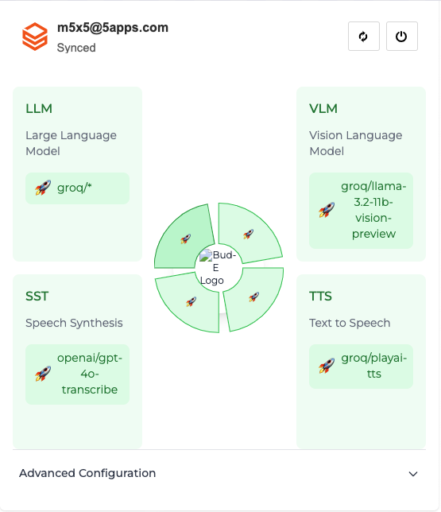

# ai-wallet

Note: Guide is Not Complete yet, Only read and try to set it up if you have enought time and experience

## Features
- Syncing with the Backend
- One Login for all AI Apps
- Drop-In Web Component
- Own Your Data
- Easy AI Provider Setup (use any AI provider)
- Open Source

## Screenshot


A new standard for accessing AI in Applications.


## Getting started with AI Wallet

Clone the repo, and install the dependencies:
```shell
npm install ai-wallet
```

Start the stencil dev server:
```shell
npm start
```

If you would like to build the application:
```shell
npm run build
```

# How to setup your own AI

- Create an ollama instance and run a model of your choice.
- Enter the URL of the ollama instance in the component.
- If the application that you want to use correctly uses this component, you can now use the AI Wallet to access the AI model.

# How to become an AI Provider

- Use LiteLLM to spin up an instance and connect it to your ai model that you're running.
- Contact me or create a GitHub issue once the repository exists
