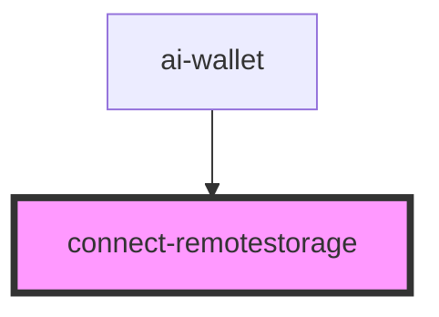

# connect-remotestorage

<!-- Auto Generated Below -->

## Properties

| Property | Attribute | Description | Type            | Default     |
| -------- | --------- | ----------- | --------------- | ----------- |
| `rs`     | `rs`      |             | `RemoteStorage` | `undefined` |

## Dependencies

### Used by

 - [ai-wallet](..)

### Graph

----------------------------------------------

*Built with [StencilJS](https://stenciljs.com/)*
