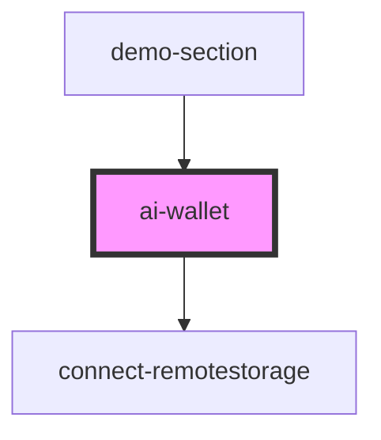

# ai-wallet

<!-- Auto Generated Below -->

## Properties

| Property       | Attribute      | Description | Type      | Default                        |
| -------------- | -------------- | ----------- | --------- | ------------------------------ |
| `capabilities` | `capabilities` |             | `any`     | `["vlm", "llm", "sst", "tts"]` |
| `cardTitle`    | `card-title`   |             | `string`  | `undefined`                    |
| `subtitle`     | `subtitle`     |             | `string`  | `undefined`                    |
| `sync`         | `sync`         |             | `boolean` | `true`                         |

## Events

| Event           | Description | Type                          |
| --------------- | ----------- | ----------------------------- |
| `configChanged` |             | `CustomEvent<AIWalletConfig>` |

## Methods

### `getConfiguration() => Promise<AIWalletConfig>`

#### Returns

Type: `Promise<AIWalletConfig>`

### `getRemoteStorage() => Promise<any>`

#### Returns

Type: `Promise<any>`

### `saveConfiguration() => Promise<boolean>`

#### Returns

Type: `Promise<boolean>`

## Dependencies

### Used by

 - [demo-section](../demo-section)

### Depends on

- [connect-remotestorage](connect-remotestorage)

### Graph

----------------------------------------------

*Built with [StencilJS](https://stenciljs.com/)*
